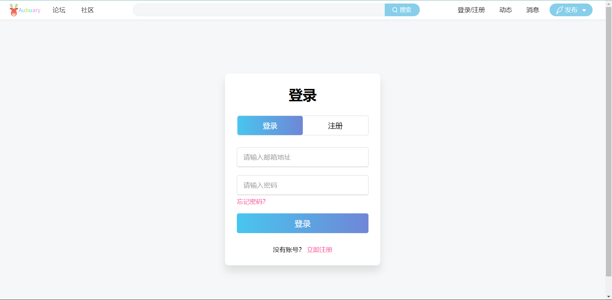
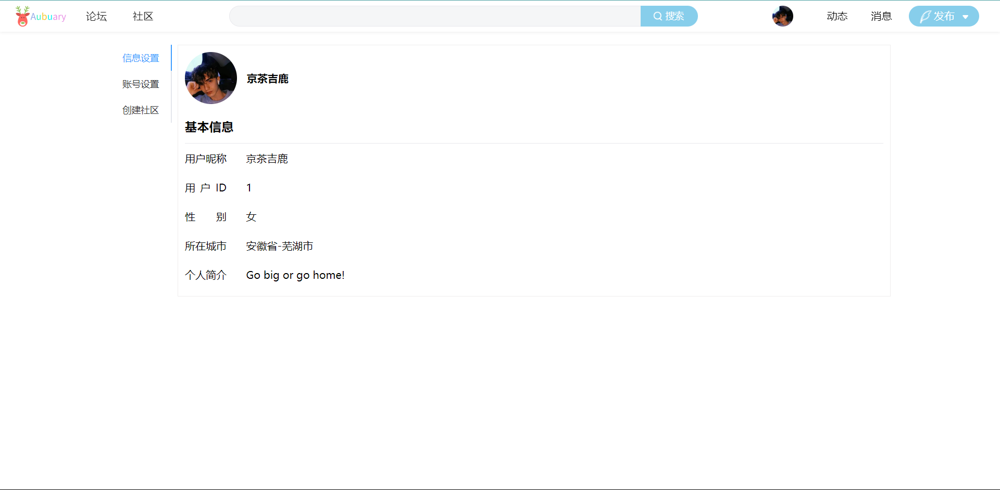
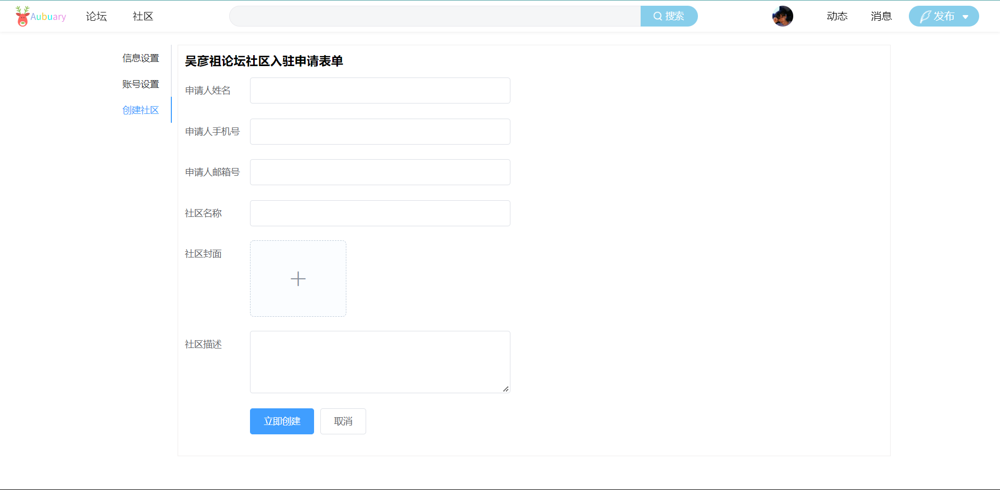
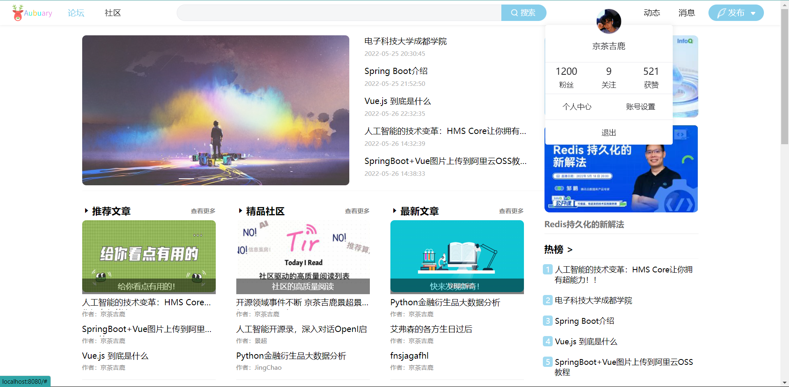
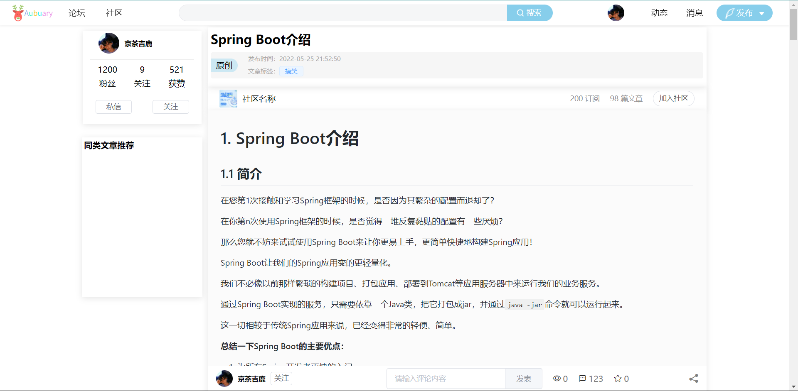
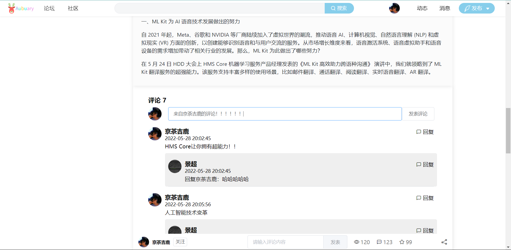
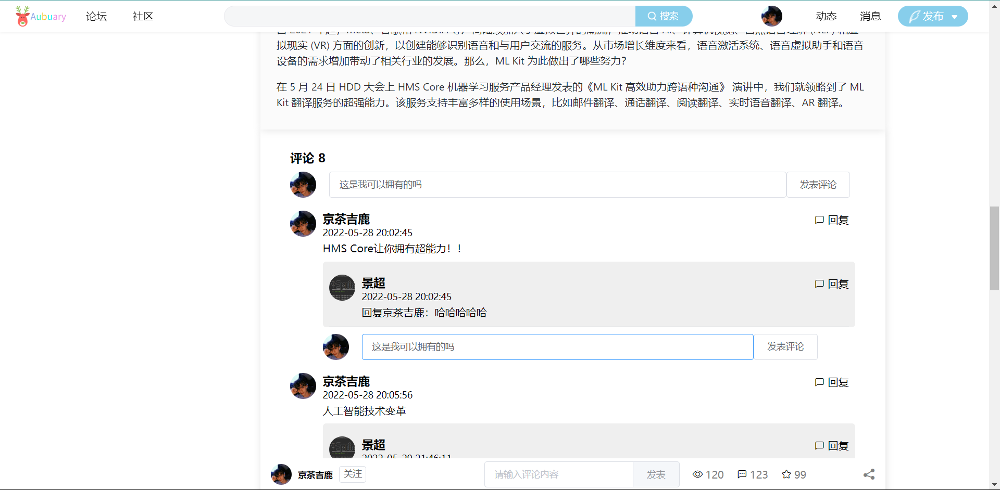
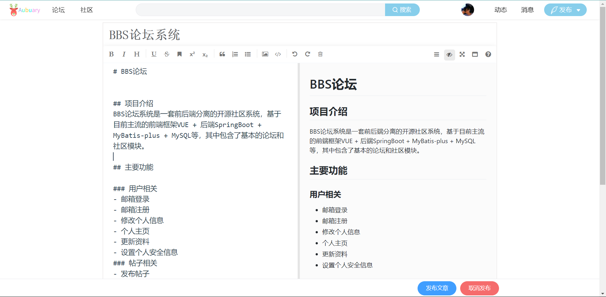
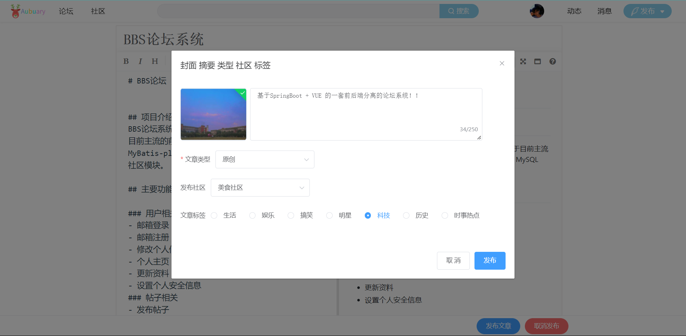

# BBS论坛

## 项目介绍
BBS论坛系统是一套前后端分离的开源社区系统，基于目前主流的前端框架VUE + 后端SpringBoot + MyBatis-plus + MySQL等，其中包含了基本的论坛和社区模块。

## 主要功能

### 用户相关
- 邮箱登录
- 邮箱注册
- 修改个人信息
- 个人主页
- 更新资料
- 设置个人安全信息
### 帖子相关
- 发布帖子
- 评论
- 回复
- 点赞
- 收藏
- 帖子分类
- 话题标签
- 内容审核
### 社区相关
- 社区加入
- 社区退出
- 社区创建
- 内容审核
- 发布内容

## 功能列表
- 注册
- 登录
  - 忘记密码
- 个人中心
  - 头像上传
  - 个人信息完善
- 帖子模块
  - 发布帖子
  - 展示帖子
    - 按照时间展示
    - 按照阅读量展示
    - 按照系统推荐展示
  - 查看帖子详情
  - 权限管理
    - 未登录用户不能发布帖子
    - 管理员可以进行删除，禁用操作
- 评论模块
  - 发布评论
  - 发布对评论者的回复
  - 权限管理
    - 未登录用户不能进行评论
    - 管理员可以进行评论删除
- 社区模块
  - 社区内发布文章
  - 加入社区
  - 退出社区
  - 创建社区
  - 权限管理
    - 用户加入退出需要社区负责人审核
    - 管理员可以进行社区审核
    - 管理员进行社区的封禁操作

## 界面展示

